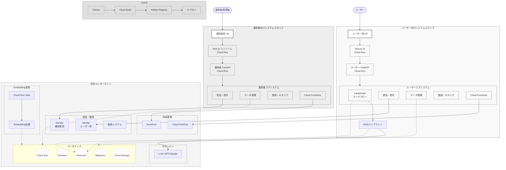

```mermaid
graph TD
    %% 主要ユーザーグループと入口点
    User([ユーザー]) --> UserLB[ユーザー用 LB]
    Admin([運用者/管理者]) --> AdminLB[運用者用 LB]
    
    %% ユーザー向けスタック
    subgraph UserStack[ユーザー向けシステムスタック]
        direction TB
        UserLB --> NextUser[Next.js UI<br>Cloud Run]
        NextUser --> UserCR[ユーザー FastAPI<br>Cloud Run]
        
        %% ユーザー向けコアシステム
        UserCR --> UserCore[ユーザーコアシステム]
        
        subgraph UserCore[ユーザーコアシステム]
            direction TB
            LG[LangGraph<br>ワークフロー]
            UserAuth[認証・認可]
            UserDB[データ管理]
            UserMon[監視・ロギング]
            UserCF[Cloud Functions]
        end
        
        %% AIエンジン接続
        LG --> RAG
    end
    
    %% 運用者向けスタック
    subgraph AdminStack[運用者向けシステムスタック]
        direction TB
        AdminLB --> NextAdmin[Next.js コンソール<br>Cloud Run]
        NextAdmin --> AdminCR[運用者 FastAPI<br>Cloud Run]
        
        %% 運用者向けコアシステム
        AdminCR --> AdminCore[運用者コアシステム]
        
        subgraph AdminCore[運用者コアシステム]
            direction TB
            AdminAuth[認証・認可]
            AdminDB[データ管理]
            AdminMon[監視・ロギング]
            AdminCF[Cloud Functions]
        end
    end
    
    %% 共有コンポーネント
    subgraph SharedComponents[共有コンポーネント]
        %% AIエンジン
        subgraph AIEngine[AIエンジン]
            RAG[RAGパイプライン] --> LLM[LLM: GPT/Claude]
        end
        
        %% Embedding更新
        subgraph EmbeddingSystem[Embedding更新]
            CRJ[Cloud Run Jobs] --> EB[Embedding処理]
        end
        
        %% データストア
        subgraph DataStores[データストア]
            SQL[(Cloud SQL)]
            FS[(Firestore)]
            VS[(Pinecone)]
            BQ[(BigQuery)]
            CS[(Cloud Storage)]
        end
        
        %% 外部連携
        subgraph ExternalServices[外部連携]
            PS[Cloud Pub/Sub]
            SG[SendGrid]
        end
        
        %% 認証・監視
        subgraph AuthMonitoring[認証・監視]
            UserIP[Identity<br>ユーザー用]
            AdminIP[Identity<br>運用者用]
            Monitoring[監視システム]
        end
    end
    
    %% CI/CD
    subgraph CICD[CI/CD]
        GH[GitHub] --> CBA[Cloud Build]
        CBA --> AR[Artifact Registry]
        AR --> Deploy[デプロイ]
    end
    
    %% 主要接続（シンプル化）
    UserAuth --> UserIP
    AdminAuth --> AdminIP
    UserDB -.-> DataStores
    AdminDB -.-> DataStores
    UserCF --> PS
    AdminCF --> SG
    LG -.-> VS
    EB -.-> DataStores
    RAG -.-> VS
    
    %% スタイル
    classDef userSide fill:#f9f9f9,stroke:#666666
    classDef adminSide fill:#eeeeee,stroke:#666666
    classDef shared fill:#f5f5f5,stroke:#888888
    classDef ci fill:#e0e0e0,stroke:#777777
    classDef database fill:#ffffff,stroke:#999999,stroke-dasharray: 5 5
    classDef endpoint fill:#ffffff,stroke:#444444,stroke-width:2px
    
    class UserStack,NextUser,UserCR,UserCore,LG,UserAuth,UserDB,UserMon,UserCF userSide
    class AdminStack,NextAdmin,AdminCR,AdminCore,AdminAuth,AdminDB,AdminMon,AdminCF adminSide
    class SharedComponents,AIEngine,EmbeddingSystem,ExternalServices,AuthMonitoring shared
    class CICD,GH,CBA,AR,Deploy ci
    class SQL,FS,VS,BQ,CS database
    class UserLB,AdminLB endpoint
```
