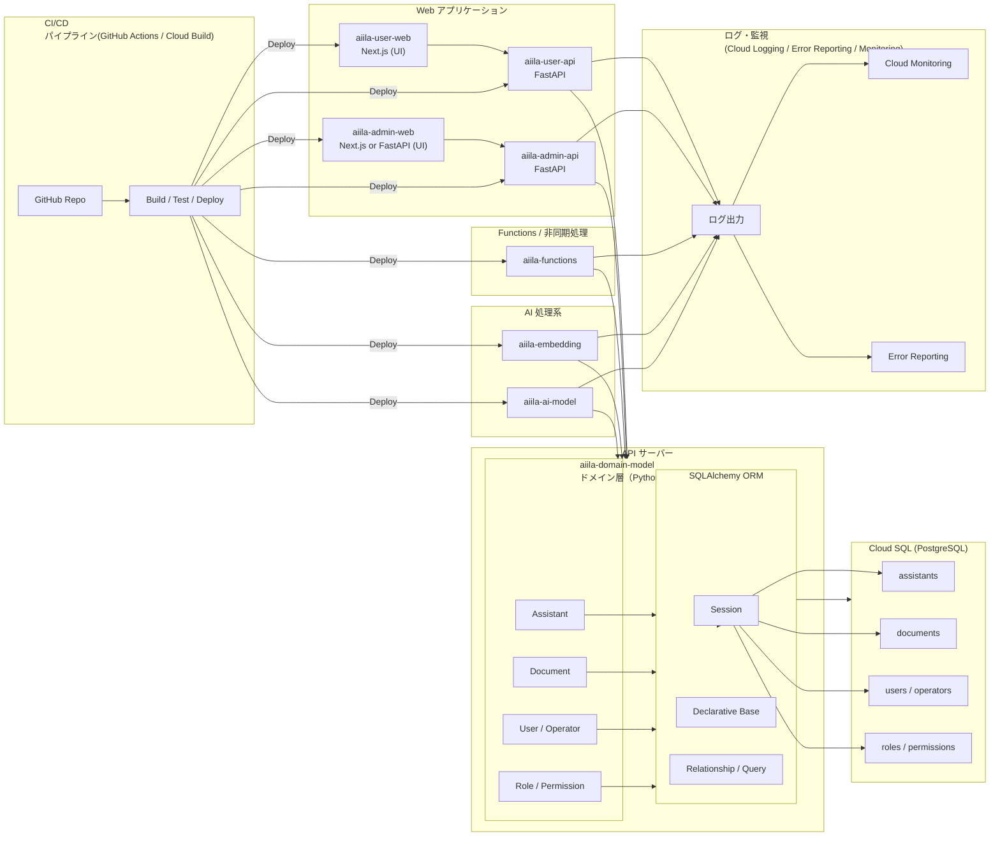

```mermaid
graph LR

    %% Web アプリケーション層
    subgraph WebApps["Web アプリケーション"]
        USER_WEB["aiila-user-web<br/>Next.js (UI)"] --> USER_API
        ADMIN_WEB["aiila-admin-web<br/>Next.js or FastAPI (UI)"] --> ADMIN_API
    end

    %% API 層
    subgraph APIs["API サーバー"]
        USER_API["aiila-user-api<br/>FastAPI"] --> DOMAIN
        ADMIN_API["aiila-admin-api<br/>FastAPI"] --> DOMAIN
    end

    %% バックグラウンド・非同期処理
    subgraph Functions["Functions / 非同期処理"]
        FUNCTIONS["aiila-functions"] --> DOMAIN
    end

    %% AI 関連処理
    subgraph AI["AI 処理系"]
        EMBEDDING["aiila-embedding"] --> DOMAIN
        AI_MODEL["aiila-ai-model"] --> DOMAIN
    end

    %% ドメインモデル
    subgraph DOMAIN["aiila-domain-model<br/>ドメイン層（Python パッケージ）"]
        style DOMAIN width:250px;
        DM_Assistant[Assistant]
        DM_Document[Document]
        DM_User["User / Operator"]
        DM_Role["Role / Permission"]

        DM_Assistant --> ORM
        DM_Document --> ORM
        DM_User --> ORM
        DM_Role --> ORM
    end

    %% ORM
    subgraph ORM["SQLAlchemy ORM"]
        Session[Session]
        Base["Declarative Base"]
        RelQuery["Relationship / Query"]
    end

    ORM --> DB

    %% データベース
    subgraph DB["Cloud SQL (PostgreSQL)"]
        DB_Assistants[assistants]
        DB_Documents[documents]
        DB_Users["users / operators"]
        DB_Roles["roles / permissions"]
    end

    %% CI/CD
    subgraph CICD["CI/CD <br/>パイプライン(GitHub Actions / Cloud Build)"]
        GitHub[GitHub Repo] --> BuildDeploy["Build / Test / Deploy"]
        BuildDeploy -->|Deploy| USER_WEB
        BuildDeploy -->|Deploy| ADMIN_WEB
        BuildDeploy -->|Deploy| USER_API
        BuildDeploy -->|Deploy| ADMIN_API
        BuildDeploy -->|Deploy| FUNCTIONS
        BuildDeploy -->|Deploy| EMBEDDING
        BuildDeploy -->|Deploy| AI_MODEL
    end

    %% ログ・監視
    subgraph MONITOR["ログ・監視<br/>(Cloud Logging / Error Reporting / Monitoring)"]
        USER_API --> Logs[ログ出力]
        ADMIN_API --> Logs
        FUNCTIONS --> Logs
        EMBEDDING --> Logs
        AI_MODEL --> Logs

        Logs --> Monitoring[Cloud Monitoring]
        Logs --> ErrorReport[Error Reporting]
    end

    %% ドメインモデルと ORM 関係
    DOMAIN --> ORM

    %% ORM と DB マッピング
    Session --> DB_Assistants
    Session --> DB_Documents
    Session --> DB_Users
    Session --> DB_Roles
```
